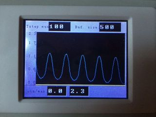
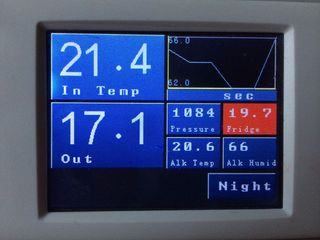

AWind library
-------------
Introduction
------------
AWind (arduino window) is Arduino-library that is intended to simplify the use of touch TFT displays for visualization of sensors data in text or chart form. It is also possible to interact with GUI by the use of display touch feature. 
The library is implemented as general window framework that allows creation of simple GUIs. The GUI is consist of text fields, buttons, chart window and etc. 
Special keyboard window is implemented to provide runtime possibility of changing text fields.
At this moment only TFT with 320x240 resolution on Arduiono Mega is tested, but the library can be adjusted to other display dimensions without big efforts.

Installation
------------
AWind library is build on top of Henning Karlsen libraries (many thanks for that libraries. It have saved pretty much of my time): 
* [UTFT] (http://www.rinkydinkelectronics.com/library.php?id=87)
* [UTouch] (http://www.rinkydinkelectronics.com/library.php?id=88)

You need uncompressed them into  arduinosketchfolder/libraries/ folder

The AWind library refers AFrame and ASensor libraries
* [AFrame] (https://github.com/AndreiDegtiarev/AFrame)
* [ASensor] (https://github.com/AndreiDegtiarev/AFrame)

To install you need "Clone in Desktop" them into arduinosketchfolder/libraries/ folder, or if you use "Download ZIP" - unzip them and then remove the "-master" from the folder names.
Restart the IDE

How to connect TFT-display see the UTFT documentation.

Documentation
------------
API documentation: http://andreidegtiarev.github.io/AWind/

Examples
--------
In the each example folder there is a screen-shots to demonstrate how results should looks like
* [Text] (examples/Text/README.md): Simple example that demonstrate the basic use of text window + touch interaction
* [Charts] (examples/Charts/README.md): Simple example that demonstrate the basic use of chart window 

* [Oscilloscope] (examples/Oscilloscope/README.md): Simple Oscilloscope with possibility to adjust (in runtime) sample ratio, voltage level and signal length

* [SensorsMonitor] (examples/SensorsMonitor/README.md): This example is based on my personal application - monitor temperature in my camper (outside, inside, fridge: beer has to be cold :-) and etc.). The sensors in this example work in DEMO-mode and real sensors connections is not needed

* [Gauges] (examples/Gauges/README.md): This example demonstrates how to use gauge and button controls
