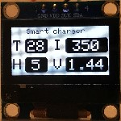

AWind library
-------------
Introduction
------------
AWind (arduino window) is Arduino-library that is intended to simplify the use of touch TFT and OLED displays for visualization of sensors data in text or chart form. It is also possible to interact with GUI by the use of display touch feature. 
The library is implemented as general window framework that allows creation of simple GUIs. The GUI is consist of labels, text fields, buttons, tab control, gauges, chart window and etc. 
For TFT the special keyboard window is implemented to provide runtime possibility of changing text fields.
At this moment TFT and OLED displays are tested on Arduiono Mega and Arduino DUE. ESPxx boards are comming soon.

Installation
------------
TFT via UTFT library
------------
* [UTFT](http://www.rinkydinkelectronics.com/library.php?id=51)
* [UTouch](http://www.rinkydinkelectronics.com/library.php?id=55)

OLED via Adafruit-GFX library
------------
* [Adafruit-GFX-Library ](https://github.com/adafruit/Adafruit-GFX-Library)
* Install Adafruit driver for your display. In my case it is [SSD1306](https://github.com/adafruit/Adafruit_SSD1306) display 

Uncompress those libraries into  arduinosketchfolder/libraries/ folder

To connect display see descriptions for corresponding hardware and libraries .

The content of awind_full.zip from https://github.com/AndreiDegtiarev/AWind/releases uncompress into arduinosketchfolder/libraries/ folder.

Restart the IDE

Documentation
------------
API documentation: http://andreidegtiarev.github.io/AWind/

Examples
--------
TFT
--------
In the each example folder there is a screen-shots to demonstrate how results should looks like
* [Text](https://github.com/AndreiDegtiarev/AWind/examples/Text): Simple example that demonstrate the basic use of text window + touch interaction
* [Charts](https://github.com/AndreiDegtiarev/AWind/examples/Charts): Simple example that demonstrate the basic use of chart window 

* [Oscilloscope](https://github.com/AndreiDegtiarev/AWind/examples/Oscilloscope): Simple Oscilloscope with possibility to adjust (in runtime) sample ratio, voltage level and signal length

* [SensorsMonitor](https://github.com/AndreiDegtiarev/AWind/examples/Oscilloscopeexamples/SensorsMonitor): This example is based on my personal application - monitor temperature in my camper (outside, inside, fridge: beer has to be cold :-) and etc.). The sensors in this example work in DEMO-mode and real sensors connections is not needed

* [Gauges](https://github.com/AndreiDegtiarev/AWind/examples/Oscilloscopeexamples/Gauges): This example demonstrates how to use gauge and button controls

* [Dialogs](https://github.com/AndreiDegtiarev/AWind/examples/Oscilloscopeexamples/Dialogs): This example demonstrates how handle nested dialogs

* [Tab control](https://github.com/AndreiDegtiarev/AWind/examples/Oscilloscopeexamples/TabControl): This example demonstrates how to work with tab controls

* [Vacuum Pump](https://github.com/AndreiDegtiarev/AWind/examples/Oscilloscopeexamples/VacuumPump): This advance example demonstrates how to work with tab controls, timer, how interact with stepper motor, relay and etc.

* [Window selector](https://github.com/AndreiDegtiarev/AWind/examples/Oscilloscopeexamples/WindowSelector): This example demonstrates how to control child window visibility

OLED
--------
* [GfxOLED_DHT](https://github.com/AndreiDegtiarev/AWind/tree/master/examples/GfxOLED_DHT): interaction with DHT sensor

* [GfxOLED_Oscilloscope](https://github.com/AndreiDegtiarev/AWind/tree/master/examples/GfxOLED_Oscilloscope): simple oscilloscope

* [GfxOLED_SmartCharger](https://github.com/AndreiDegtiarev/AWind/tree/master/examples/GfxOLED_Oscilloscope): smart NiMH battery charger

