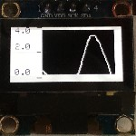

Simple oscilloscope
------------
Introduction
------------
Example is intended to demonstrate following features of AWind library: 
- Usage of OLED SSD1306 displays 
- Chart control
- Measurement on analog pin

Hardware connection
-------------------
- Connect display
- Signal is read on A0 analog pin 

